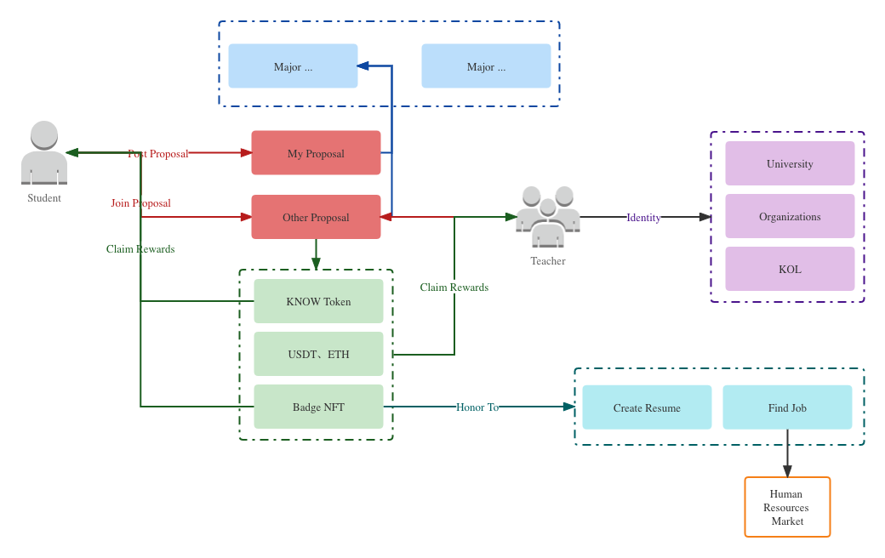

# PR 编号 11
# Knowlage-dapp (Learn To Earn)

## 队伍信息
### 队伍/作品名称
Knowlage

### ERC20 地址
0x3264Cf09543C9E713DDE3Fb2A87A9FE9513A0d59

### 产品简介
参与者可以发起提案众筹一个精品课件，结束后可获得Token激励和徽章NFT以用于市场投放简历或寻找兼职

#### 产品流程图简介

### 作品代码仓库
https://github.com/uninstalls/knowlage-dapp

### 成员

Vitalik
- 产品/合约/前端/后台
- https://twitter.com/Xmas118
- 0x3264Cf09543C9E713DDE3Fb2A87A9FE9513A0d59

李树
- 合约
- 0xFc42989B0BCa31a778bFa46ea3A30169cA363c0B
