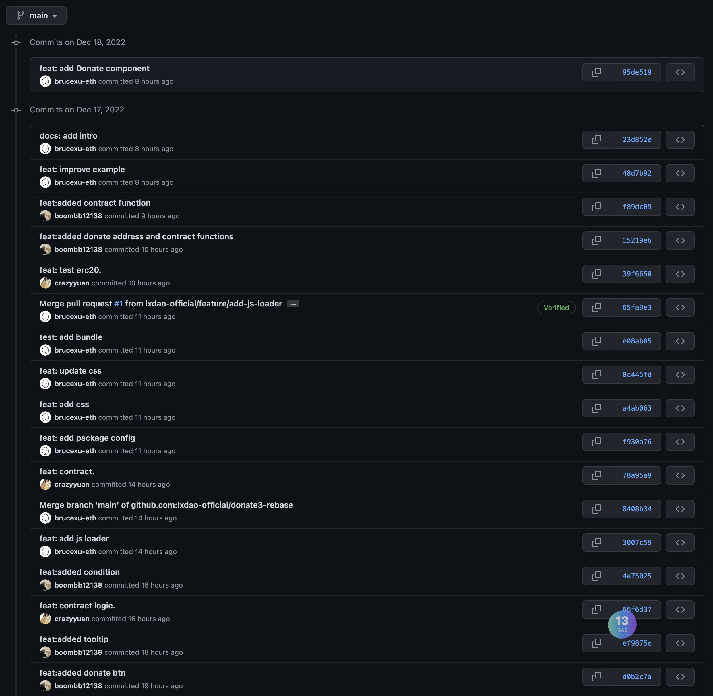

# PR15

# 队伍信息

## 队伍/作品名称

Donate3

## ERC20 地址(用于团队接收奖励)

0x17c57bD297175e5711Ee3Daf045252B588f3162F

## 作品简介

Donate3 是一款针对捐赠场景的工具产品。在 Web3 的时代，捐赠对于去中心化非垄断性的产品或者个人至关重要（少了平台扶持），因此我们将提供非常简单易用同时附带数据分析和证明的捐赠工具来满足大家的需求。

首先，Donate3 工具非常简单易用，方便快速集成到自己的网站、文章等地方。然后为了鼓励大家捐赠，捐赠之后，将会获得一个 SBT 作为捐赠证明，以此来证明当前转账为捐赠行为而非交易。最后，基于链上的 SBT 数据，我们可以分析和拉取捐赠相关信息，配合 ENS 可以生成丰富的捐赠信息，以此产生广告的属性吸引更多捐赠者。

作品创意：相比转账类捐赠，我们利用 SBT 等实现了链上捐助证明来积累声誉，并以此吸引更多人对优质作品和创作者进行捐赠，也方便创作者和项目方回溯空投。通过手续费可以持续不断的维护这个产品，使其更加简单易用方便接入，以此实现可持续性闭环：创作者方便集成接收捐赠来做事情 -> 喜爱作品的人易于捐赠并且可以享受声誉和未来的空头预期 -> Donate3 拿到手续费持续优化产品和宣传推广。

本次黑客松中完成的内容：**全部的 MVP 代码均在本次黑客松期间完成**，请查看我们代码仓库的 commit 记录！

作品未来计划：提交捐赠信息作为 EIP 来丰富链上的信息维度，方便积累声誉；调研使用 EthStorage 来存储捐赠数据；优化合约 Gas fee；支持多链和 Layer2 等部署和多币种捐赠；实现丰富的数据分析和报表。

欢迎天使轮注资 ：）

## 作品代码仓库

https://github.com/lxdao-official/donate3-rebase

## 成员

Bruce Xu

- 开发，Donate3 PM
- https://github.com/brucexu-eth
- 0x17c57bD297175e5711Ee3Daf045252B588f3162F

wwei

- 前端开发
- https://github.com/wwei-github
- 0x257c21206df8a751dE09B3502B32d25888099DB9

Naomi Li

- 前端开发
- https://github.com/boombb12138
- 0x1532d98e151028BA6f4241b136c4844002612a30

Khan

- 合约开发
- https://github.com/crazyyuan
- 0x97B7F8fDB22d5BAb6C0AcF3Cd319eC18da8063c3

Yootou

- 救火队队长
- https://github.com/0xYootou
- 0xF95555A29E58188147D3A3AcD6e2Ffeb04EA7dd5
