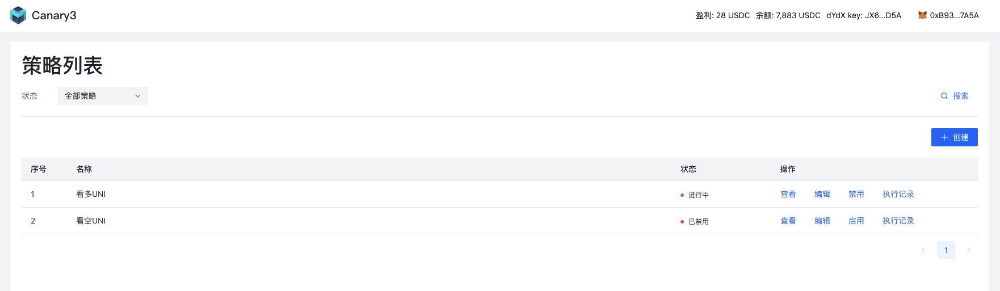
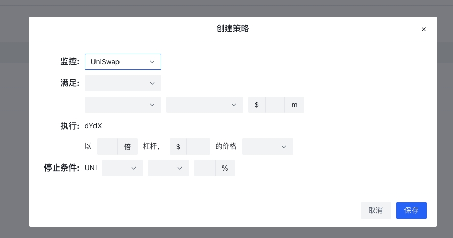
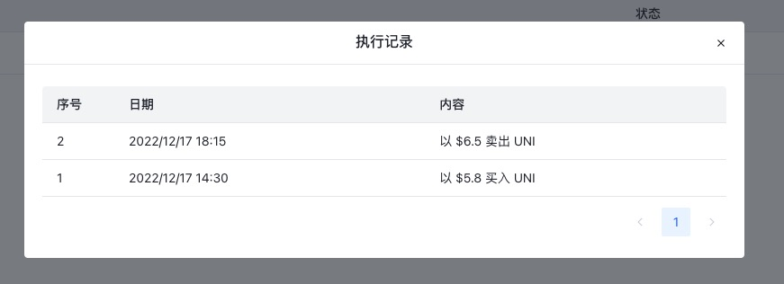

# Canary3 前端
> 设置策略，帮用户获取收益。

功能演示 Demo：[这里](https://www.capcut.cn/share/7177950888768705830?t=1)。

策略列表: 


创建策略: 


策略执行记录: 


## 快速开始

```
// 初始化项目
npm install

// 开发模式
npm run dev

// 构建
npm run build
```